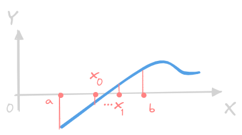
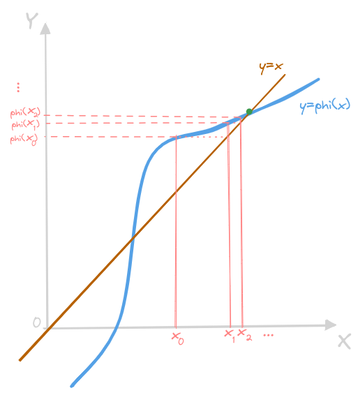
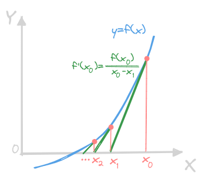
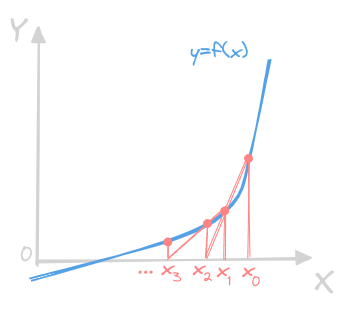
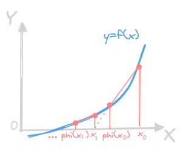
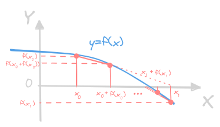

# 非线性方程求根
---
## 概述
- 针对非线性方程的实根计算：
    $$f(x)=0$$
    其中 $f(x)$ 为**连续函数**，若 $f(x)$ 为多项式函数、则为代数方程（大于4的方程一般没有通用求根公式）
- **隔根区间**：区间内**只包含方程的一个根**
- 计算机求解非线性方程：
    - 根的隔离：
        - 画图：拆成 $f_{1}(x)=f_{2}(x)$
        - 分析：连续性、介值定理、单调性
        - 搜索：一定区间上取适当步长，取区间 $[x_{i},x_{i+1}]$，如果
            $$f(x_{i})\cdot f(x_{i+1}) < 0$$
            则为有根区间，若在此基础上在这个有根区间内 $f'(x)>0$ 或 $f'(x)<0$ ，则区间 $[x_{i},x_{i+1}]$ 为**隔根区间**
    - 根的精确化：
        - 在**隔根区间**内从给定的初值出发，产生序列，收敛到方程的根
        - 讨论数值方法的收敛性、收敛快慢、误差估计
- 方程的根和零点：
    - 方程 $f(x)=0$ 的根或函数 $f(x)$ 的零点 $\alpha$：
        $$f(\alpha) = 0$$
    - 分解 $f(x)$ 为：
        $$f(x) = (x-\alpha)^{m}g(x),\qquad \mathrm{s.t.}(g(\alpha)\neq0)\wedge(m\in \mathbb Z^{+})$$
        - $m=1$：$\alpha$ 为 $f(x)=0$ 的**单根**或**单零点**
        - $m\geq 2$：$\alpha$ 为 $f(x)=0$ 的$m$**重根**或$m$**重零点**
> 若 $f(x)$ 有 $m$ 阶连续导数，则 $\alpha$ 为 $f(x)$ 的 $m$ 重零点等价于：
> $$
> \begin{align*}
> f(\alpha) &=0;\\
> f'(\alpha) &=0;\\
> f''(\alpha) &=0;\\
> \vdots\\
> f^{(m-1)}(\alpha) &=0;\\
> f^{(m)}(\alpha) &\neq0;\\
> \end{align*}
> $$

## 二分法
- 基于**隔根区间**，由介值定理：
    $$(x\in[a,b],\mathrm{s.t.}f(a)f(b)< 0)\qquad\implies\qquad \exists c\in[a,b],\mathrm{s.t.}f(c)=0$$
    - 根据区间中点处函数值的符号不断对**隔根区间**进行压缩
    - 由一系列隔根区间中点构成的序列逼近方程的根
- 二分法：
    $$[a_{1},b_{1}]\qquad\rightarrow\qquad x_{1}=\displaystyle\frac{1}{2}(a_{1}+b_{1})\qquad\rightarrow\qquad[a_{1},x_{1}],[x_{1},b_{1}]$$
    - 若 $f(x_{1})f(a_{1})<0$，则 $f(x)$ 在 $[a_{1},x_{1}]$ 内有零点，令 $[a_{2},b_{2}]=[a_{1},x_{1}]$
    - 若 $f(x_{1})f(b_{1})<0$，则 $f(x)$ 在 $[x_{1},b_{1}]$ 内有零点，令 $[a_{2},b_{2}]=[x_{1},b_{1}]$
    - 若 $f(x_{1})=0$，则 $f(x)$ 的零点为 $x=x_{1}$ 
    $$[a_{2},b_{2}]\qquad\rightarrow\qquad x_{2}=\displaystyle\frac{1}{2}(a_{2}+b_{2})\qquad\rightarrow\qquad[a_{2},x_{2}],[x_{2},b_{2}]$$
    - 若 $f(x_{2})f(a_{2})<0$，则 $f(x)$ 在 $[a_{2},x_{2}]$ 内有零点，令 $[a_{3},b_{3}]=[a_{2},x_{2}]$
    - 若 $f(x_{2})f(b_{2})<0$，则 $f(x)$ 在 $[x_{2},b_{2}]$ 内有零点，令 $[a_{3},b_{3}]=[x_{2},b_{2}]$
    - 若 $f(x_{2})=0$，则 $f(x)$ 的零点为 $x=x_{2}$ 
    - $\cdots$

    

- 如果一直二分下去，取 $k=1,2,3,\cdots$ 
    $$
    [a_{k},b_{k}]\leftarrow[a_{k-1},b_{k-1}]\leftarrow[a_{k-2},b_{k-2}]\leftarrow\cdots\leftarrow[a_{1},b_{1}]
    $$
    $$
    [a_{k},b_{k}]\subset[a_{k-1},b_{k-1}]\subset[a_{k-2},b_{k-2}]\subset\cdots\subset[a_{1},b_{1}]
    $$
    $$
    b_{k}-a_{k} = \frac{1}{2}(b_{k-1}-a_{k-1}) = \frac{1}{2^{2}}(b_{k-2}-a_{k-2}) = \cdots = \frac{1}{2^{k-1}}(b_{1}-a_{1})
    $$
    当 $k$ 充分大的时候，取区间 $[a_{k},b_{k}]$ 的中点 $\displaystyle\frac{1}{2}(a_{k}+b_{k})$ 作为 $f(x)$ 零点 $\alpha$ 的近似值
- 二分法收敛定理：
    - 上述 $f(x)$ 的零点 $\alpha$ 和二分法计算过程得到的 $x_{k}$ 满足：
        $$\vert x_{k}-\alpha\vert \leq \frac{1}{2}(b_{k}-a_{k})=\frac{1}{2^{k}}(b-a),\qquad (k=1,2,\cdots)$$
        则二分法产生的序列 $\{x_{k}\}_{k=1}^{\infty}$ 收敛于 $\alpha$（三角不等式放缩）
    - 二分法可以使得 $f(x)$ 的零点达到任意精度，利用绝对误差限 $\varepsilon$，取 $k$ 满足：
        $$\frac{1}{2^{k}}(b-a)\leq \varepsilon$$
        即可得到满足要求的区间对分次数 $k$，注意，最后一次对分：
        $$b_{k}-a_{k} = \frac{1}{2^{k-1}}(b_{1}-a_{1})$$
        然后取得到的 $x_{k}$：
        $$x_{k}=\frac{1}{2^{k-1}}(b_{1}-a_{1})$$
        此时：
        $$b_{k}-x_{k}=x_{k}-a_{k}=\frac{1}{2}\times\frac{1}{2^{k-1}}(b_{1}-a_{1})=\frac{1}{2^{k}}(b_{1}-a_{1})=\frac{1}{2^{k}}(b-a)$$
        因此对分次数为 $k$ 取得的 $x_{k}$ 是满足上述不等式的，并且：
        $$\vert x_{k}-\alpha\vert \leq (b_{k}-x_{k})\leq\frac{1}{2^{k}}(b-a)\leq \varepsilon$$
    - 二分法迭代格式收敛较慢，不能求方程的复根和偶数重根，一般用来求使迭代开始的**一个较好的根的初始近似值**

## 不动点迭代的基本理论
- 迭代法：
    - 取初始值
    - 根据迭代公式进行计算
    - 判别收敛

### 不动点迭代
- 不动点：$f(x)=0$ 在 $[a,b]$ 有唯一解 $\alpha$，写成**同解方程**
    $$x=\varphi(x)$$
    则 $\alpha$ 为函数 $\varphi(x)$ 的不动点
- $f(x)$ 的零点等价于 $\varphi(x)$ 的不动点，构建迭代公式：
    $$x_{k+1}=\varphi(x_{k})$$
- 压缩映射：
    $$
    \vert x_{k+1}-x_{k}\vert = 
    \vert \varphi(x_{k})-\varphi(x_{k-1})\vert \leq \delta\vert x_{k}-x_{k-1}\vert
    $$
    其中 $\delta\in[0,1)$，则：
    $$
    \vert x_{k+1}-x_{k}\vert = 
    \vert \varphi(x_{k})-\varphi(x_{k-1})\vert\leq 
    \delta\vert x_{k}-x_{k-1}\vert\leq\cdots
    \delta^{k}\vert x_{1}-x_{0}\vert
    $$
    在满足这样的迭代公式下，迭代是收敛的（注意，二分法是离散格式，这个是连续格式的证明）
- 迭代序列的收敛性和迭代格式的构造和初值的选取都有关系

    

### 不动点迭代的全局收敛性
- $[a,b]$ 中取任意初值 $x_{0}$ 都能保证某迭代格式收敛，则**该迭代格式具有全局收敛性**
- 若 $x=\varphi(x)$ 满足 $\varphi'(x)$ 在 $[a,b]$ 上连续，且：
    - $\forall x\in[a,b](\varphi(x)\in[a,b])$
    - $\exists L\in(0,1)(x\in[a,b]\implies\vert \varphi'(x)\vert\leq L < 1)$

    则
    - $\varphi(x)$ 在 $[a,b]$ 上有唯一不动点 $\alpha$
    - $\forall x_{0}\in[a,b], x_{k+1}=\varphi(x_{k})(k=0,1,2,\cdots)$ 收敛且
        $$\lim_{k\rightarrow\infty}x_{k}=\alpha$$
    - 误差估计：
        $$
        \vert x_{k}-\alpha\vert = 
        \vert\varphi(x_{k-1})-\varphi(\alpha)\vert\leq
        \vert\varphi'(x_{k})\vert\vert x_{k-1}-\alpha\vert \leq
        L\vert x_{k-1}-\alpha\vert
        $$
        同样的：
        $$
        \vert x_{k}-x_{k-1}\vert = 
        \vert\varphi(x_{k-1})-\varphi(x_{k-2})\vert\leq
        \vert\varphi'(x_{k-1})\vert\vert x_{k-1}-x_{k-2}\vert \leq
        L\vert x_{k-1}-x_{k-2}\vert
        $$
        由第一个式子可得：
        $$
        \vert x_{k}-\alpha\vert \leq
        L\vert x_{k-1}-\alpha\vert = L\vert x_{k-1}-x_{k}+x_{k}-\alpha\vert\leq
        L\vert x_{k}-x_{k-1}\vert+L\vert x_{k}-\alpha\vert
        $$
        变换可得：
        $$
        \vert x_{k}-\alpha\vert \leq \frac{L}{1-L}\vert x_{k}-x_{k-1}\vert
        $$
        也即：
        $$
        \vert x_{k}-\alpha\vert \leq\frac{L}{1-L}\vert x_{k}-x_{k-1}\vert
        \leq \cdots \leq
        \frac{L^{k}}{1-L}\vert x_{1}-x_{0}\vert,\qquad(k=1,2,\cdots)
        $$
        $(x_{1}-x_{0})$ 格式的为**先验误差估计**，$(x_{k}-x_{k-1})$ 格式的为**后验误差估计**
    - 误差渐进：
        $$\lim_{k\rightarrow\infty}\frac{x_{k}-\alpha}{x_{k-1}-\alpha}=\varphi'(\alpha)$$
    - 终止迭代：
        $$
        \begin{align*}
        \vert x_{k}-x_{k-1}\vert&\leq \varepsilon\\
        \vert x_{k}-\alpha\vert&\leq \frac{L\varepsilon}{1-L}\\
        \end{align*}
        $$
        取 $\alpha\approx x_{k}$
- 设 $\varphi(x)$ 在 $[a,b]$ 里有不动点 $\alpha$，且
    $$\forall x\in[a,b],\vert\varphi'(x)\vert\geq 1$$
    则对于任意的初值 $x_{0}\in[a,b]$ 且 $x_{0}\neq \alpha$，迭代格式 $x_{k+1}=\varphi(x_{k})(k=0,1,2,\cdots)$ 发散
- 全局收敛性不易判别！

### 局部收敛性与收敛阶
- 局部收敛性：设 $\varphi(x)$ 在 $[a,b]$ 里有不动点 $\alpha$，且
    $$\exists N(\alpha)=[\alpha-\delta,\alpha+\delta],\delta>0$$
    使得迭代格式 $x_{k+1}=\varphi(x_{k})(k=0,1,2,\cdots)$ 对任意初值 $x_{0}\in N(\alpha)$ 均收敛，则**该迭代格式具有局部收敛性**
- 设 $\varphi(x)$ 在 $[a,b]$ 里有不动点 $\alpha$，且 $\varphi'(x)$ 在 $\alpha$ 处连续，则
    - 当 $\vert\varphi'(\alpha)\vert < 1$ 时，迭代格式局部收敛
    - 当 $\vert\varphi'(\alpha)\vert > 1$ 时，迭代格式发散（$x_{0}\neq \alpha$）
- 先用二分法求到合适的初值，然后再进行迭代
- 收敛阶：衡量迭代收敛快慢，设 $\{x_{k}\}_{k=0}^{\infty}$ 收敛到 $\alpha$，若
    $$
    \exists p\geq 1, c > 0
    \left(\lim_{k\rightarrow\infty}\frac{\vert x_{k+1}-\alpha\vert}{\vert x_{k}-\alpha\vert^{p}}=c\right)
    $$
    有点像**$p$阶无穷小**（注意，当 $p=1$ 时，应当有 $0 < c < 1$）则序列 $\{x_{k}\}_{k=0}^{\infty}$ **$p$阶收敛**
    - $p=1$：一阶收敛、线性收敛；$p>1$：超线性收敛
    - $p=2$：二阶收敛、平方收敛；$p>2$：超平方收敛
    - $p$ 越大，收敛越快
- 设 $\varphi(x)$ 在不动点 $\alpha$ 的邻域内有 $p\in \mathbb Z^{+}$ 阶连续导数，则 $x_{0}\rightarrow\alpha$ 时，迭代格式 $x_{k+1}=\varphi(x_{k})(k=0,1,2,\cdots)$ 为 $p$ 阶收敛等价于：
    $$
    \begin{align*}
    \varphi(\alpha) &=\alpha;\\
    \varphi'(\alpha) &=0;\\
    \varphi''(\alpha) &=0;\\
    \vdots\\
    \varphi^{(p-1)}(\alpha) &=0;\\
    \varphi^{(p)}(\alpha) &\neq0;\\
    \end{align*}
    $$
    并且有：
    $$
    \lim_{k\rightarrow\infty}\frac{x_{k+1}-\alpha}{(x_{k}-\alpha)^{p}}=\frac{1}{p!}\varphi^{(p)}(\alpha)\neq0;\\
    $$
    注意当 $p=1$ 时，应当有 $0 < \vert\varphi'(\alpha)\vert < 1$
- $f(x)=0$ 有 $p$ 重实根，$\varphi(x)=x$ 有 $p$ 重不动点，**有联系，但是注意 $f(x)$ 一般为单根才用不动点迭代！**，并且若 $p=1$：
    $$\varphi'(\alpha) = c\neq 0 \wedge \vert c\vert < 1$$
    此时 $f'(\alpha) = c-1\neq 0$，进一步的推导可看[不动点迭代和函数零点的关系](./补充/不动点迭代与函数零点的关系.md)

### 不动点迭代加速：Steffensen
- 设 $\varphi(x)$ 在 $[a,b]$ 里有不动点 $\alpha$，对于不动点迭代序列：
    $$
    \begin{cases}
    x_{k+1}=\varphi(x_{k})\\
    x_{k+2}=\varphi(x_{k+1})\\
    \alpha =\varphi(\alpha)
    \end{cases}
    $$
    利用微分中值定理：
    $$
    \begin{align*}
    &\exists \xi_{k}\in(\min(\alpha,x_{k}),\max(\alpha,x_{k}))
    \qquad\,\,\,\,\,\, x_{k+1}-\alpha=\varphi(x_{k})-\varphi(\alpha)=\varphi'(\xi_{k})(x_{k}-\alpha)\\
    &\exists \xi_{k+1}\in(\min(\alpha,x_{k+1}),\max(\alpha,x_{k+1}))
    \,\,x_{k+2}-\alpha=\varphi(x_{k+1})-\varphi(\alpha)=\varphi'(\xi_{k+1})(x_{k+1}-\alpha)\\
    \end{align*}
    $$
    当 $k$ 很大的时候，$\varphi'(\xi_{k})\approx\varphi'(\xi_{k+1})$，此时：
    $$
    \frac{x_{k+2}-\alpha}{x_{k+1}-\alpha}
    \approx
    \frac{x_{k+1}-\alpha}{x_{k}-\alpha}
    $$
    得到新的近似值：
    $$
    \alpha\approx\bar x_{k}
    =
    x_{k}-\frac{(x_{k+1}-x_{k})^{2}}{x_{k+2}-2x_{k+1}+x_{k}}
    =
    x_{k}-\frac{[\varphi(x_{k})-x_{k}]^{2}}{\varphi(\varphi(x_{k}))-2\varphi(x_{k})+x_{k}}
    $$
    形成新的迭代格式：
    $$
    x_{k+1}=\psi(x_{k})=
    x_{k}-\frac{[\varphi(x_{k})-x_{k}]^{2}}{\varphi(\varphi(x_{k}))-2\varphi(x_{k})+x_{k}}
    $$
- Steffensen格式的局部收敛性：
    - 若 $\alpha$ 是 $\psi(x)$ 的不动点，则 $\alpha$ 是 $\varphi(x)$ 的不动点
    - 若 $\alpha$ 是 $\varphi(x)$ 的不动点，且 $\varphi'(x)$ 在 $\alpha$ 的邻域内连续，并且 
        $$\varphi'(\alpha)\neq 1$$
        则 $\alpha$ 是 $\psi(x)$ 的不动点（**判定局部收敛时分母不为0**）
    - 若 $\varphi(x)$ 在其不动点 $\alpha$ 内有二阶连续导数，且 
        $$\varphi'(\alpha)=A\neq 1$$
        则Steffensen迭代局部收敛（**判定局部收敛时分母不为0**，并且如果 $A=0$，原迭代格式已经至少二阶收敛）
    - 若 $\varphi''(\alpha)\neq 0$ ，则Steffensen迭代平方收敛 
    - 若 $\varphi''(\alpha)= 0$ ，则Steffensen迭代超平方收敛 
    - 如果原迭代格式的收敛阶已经大于等于2,一般不进行加速
        $$\lim_{k\rightarrow\infty}\frac{x_{k+1}-\alpha}{(x_{k}-\alpha)^{2}}=\frac{A\varphi''(\alpha)}{2(A-1)}$$
- Steffensen迭代是通过综合考虑前后端估计值来提高迭代的阶数，进而提高计算的精度和效率!
- Steffensen迭代格式的分母有点像完全平方式展开，但是幂次项变成了递归项，可能和特征方程可以联系一下？

## 牛顿迭代
- 计算 $f(x)=0$ 的根，首先对 $f(x)$ 在**零点 $\alpha$ 附近**取拉格朗日中值定理：
    $$f(x)=f(\alpha) + f'(\xi)(x-\alpha)$$
    而零点满足：
    $$f(\alpha)=0$$
    因此：
    $$f(x) = f'(\xi)(x-\alpha)$$
    也即：
    $$\alpha = x-\frac{f(x)}{f'(\xi)}$$
    如果迭代格式收敛，一定有
    $$x_{k+1}=x_{k}-\frac{f(x_{k})}{f'(x_{k})}$$
    其中：
    $$\lim_{k\rightarrow\infty}x_{k+1}=\lim_{k\rightarrow\infty}x_{k} = \lim_{k\rightarrow\infty}\xi_{k} = \alpha$$
    牛顿迭代对初值选择比较苛刻！

    

- 牛顿迭代的局部收敛性：
    - $\alpha$ 是 $f(x)=0$ 的零点，$f'(x)$ 在 $\alpha$ 的邻域内连续，则局部收敛
        $$f(x)=(x-\alpha)^{m}g(x)\qquad g(\alpha)=0$$
        可以推出：
        $$
        \varphi'(\alpha) = 
        \left(1-
        \left(1-\frac{f(\alpha)f''(\alpha)}{(f'(\alpha))^{2}}\right)
        \right) 
        = 1-\frac{1}{m}\qquad (m\geq 1)$$
    - 求单根 $m=1$ 的时候至少平方收敛
    - 求复根 $m > 1$ 的时候只有一阶收敛
- 牛顿迭代全局收敛的一个充分条件：给定 $f(x)=0$，$f''(x)$ 在 $[a,b]$ 上连续
    - $f(a)f(b) < 0$
    - $\forall x\in[a,b],\left((f'(x)\neq 0)\wedge(f''(x)\neq 0)\right)$（单调性）
    - $x_{0}\in[a,b],(f(x_{0})f''(x_{0}) > 0)$（拉格朗日+泰勒展开）

    则 $f(x)=0$ 在 $[a,b]$ 有唯一的根 $\alpha$，且按照 $x_{0}$ 作为初值的牛顿迭代收敛于 $\alpha$，注意：
    $$(f'(x)\neq0) \wedge (f(\alpha)=0)$$
    则：
    $$
    \lim_{k\rightarrow\infty}
    \frac{x_{k+1}-\alpha}
    {x_{k}-\alpha} =
    \frac{f(\alpha)f''(\alpha)}{(f'(\alpha))^{2}} =
    \varphi'(\alpha) = 0
    $$
    因此
    $$
    \begin{align*}
    \varphi''(\alpha)
    &=
    \lim_{x\rightarrow\alpha}
    \frac{f(x)f''(x)/(f'(x))^{2}-f(\alpha)f''(\alpha)/(f'(\alpha))^{2}}
    {x-\alpha}\\
    &=
    \lim_{x\rightarrow\alpha}
    \frac{f(x)f''(x)}{x-\alpha}
    \frac{1}{(f'(x))^{2}}\\
    &=
    \lim_{x\rightarrow\alpha}
    \frac{f(x)-f(\alpha)}{x-\alpha}
    \frac{f''(x)}{(f'(x))^{2}}\\
    &=
    f'(\alpha)\times 
    \frac{f''(\alpha)}{(f'(\alpha))^{2}}\\
    &=
    \frac{f''(\alpha)}{f'(\alpha)}
    \end{align*}
    $$
    因此：
    $$
    \lim_{k\rightarrow\infty}
    \frac{x_{k+1}-\alpha}
    {(x_{k}-\alpha)^{2}}=
    \frac{1}{2!}\varphi''(\alpha)=
    \frac{f''(\alpha)}{2f'(\alpha)}
    $$
    也即在这种情况下牛顿迭代求单根，平方收敛

- 牛顿迭代全局收敛的另一个充分条件：给定 $f(x)=0$，$f''(x)$ 在 $[a,b]$ 上连续
    - $f(a)f(b) < 0$
    - $\forall x\in[a,b],\left((f'(x)\neq 0)\wedge(f''(x)\neq 0)\right)$（单调性）
    - $\displaystyle\left\vert\frac{f(a)}{f'(a)}\right\vert\leq b-a$, $\displaystyle\left\vert\frac{f(b)}{f'(b)}\right\vert\leq b-a$ （保证 $x_{0}$ 取 $x_{a},x_{b}$ 得到的序列 $\{x_{k}\}_{k=0}^{\infty}$ 均在 $[a,b]$ 内）

    则对于任意的初值 $x_{0}\in[a,b]$，牛顿迭代得到的序列 $\{x_{k}\}_{k=0}^{\infty}$ 收敛于 $f(x)=0$ 的根 $\alpha$

## 牛顿迭代的变形
### 求重根的修正牛顿法
- 修正格式：
    $$x_{k+1} = x_{k}-m\frac{f(x_{k})}{f'(x_{k})}\qquad(k=1,2,3,\cdots)$$
    其中 $\alpha$ 为 $f(x)=0$ 的 $m\geq 2$ 重根，满足
    $$\varphi'(\alpha) = 1-m\times\frac{1}{m} = 1-1=0$$
    因此，若 $f'(x)$ 在 $\alpha$ 连续则至少二阶收敛
- 考虑函数：
    $$\mu(x)=\frac{f(x)}{f'(x)}$$
    当 $m\geq 2$ 时，$\alpha$ 是 $\mu(x)=0$ 的单根（找**充分性强条件**）：
    $$
    \mu'(\alpha) = \frac{(f'(\alpha))^{2}-f(\alpha)f''(\alpha)}{(f'(\alpha))^{2}} = 
    1-\frac{f(\alpha)f''(\alpha)}{(f'(\alpha))^{2}} = 1-\left(1-\frac{1}{m}\right) = \frac{1}{m}\neq 0
    $$
    因此求出 $\mu(x)$ 的**单重零点**便可以得到 $f(x)$ 的 $m$ 重零点，对 $\mu(x)$ 使用牛顿迭代：
    $$\zeta(x) = x-\frac{\mu(x)}{\mu'(x)} = x-\frac{f(x)f'(x)}{(f'(x))^{2}-f(x)f''(x)}$$
    如果 $f''(\alpha)$ 在 $\alpha$ 连续，则迭代格式：
    $$
    x_{k+1} 
    = x_{k}-\frac{f(x_{k})f'(x_{k})}{(f'(x_{k}))^{2}-f(x_{k})f''(x_{k})}
    \qquad (k=0,1,\cdots)
    $$
    局部至少二阶收敛
- 结合加速方法确定根的重数：
    $$
    \lim_{k\rightarrow\infty}
    \frac{x_{k+1}-\alpha}{x_{k}-\alpha}
    =\varphi'(\alpha)=
    1-\frac{1}{m}\qquad\implies\qquad
    m=\lim_{k\rightarrow\infty}\frac{\alpha-x_{k}}{x_{k+1}-x_{k}}
    $$
    利用Steffensen加速的 $\alpha$：
    $$
    \alpha = 
    \lim_{k\rightarrow\infty}
    \left(x_{k}-\frac{(x_{k+1}-x_{k})^{2}}{x_{k+2}-2x_{k+1}+x_{k}}\right)
    $$
    代入到式子中：
    $$
    m=\lim_{k\rightarrow\infty}
    \frac{x_{k}-x_{k+1}}{x_{k+2}-2x_{k+1}+x_{k}}
    $$
    实际上：
    $$
    \begin{align*}
    \lim_{k\rightarrow\infty}
    \frac{x_{k}-x_{k+1}}{x_{k+2}-2x_{k+1}+x_{k}}&=
    \lim_{k\rightarrow\infty}
    \frac{(x_{k}-\alpha)-(x_{k+1}-\alpha)}{((x_{k+2}-\alpha)-(x_{k+1}-\alpha))-((x_{k+1}-\alpha)-(x_{k}-\alpha))}\\
    &=
    \lim_{k\rightarrow\infty}
    (1-(1-\frac{1}{m}))\frac{(x_{k}-\alpha)}
    {((x_{k+2}-\alpha)-(x_{k+1}-\alpha))-((x_{k+1}-\alpha)-(x_{k}-\alpha))}\\
    &=
    \lim_{k\rightarrow\infty}
    \frac{1}{m}\times
    \left(
    -\frac{1}{m}
    \left(1-\frac{1}{m}\right)+
    \frac{1}{m}
    \right)^{-1}
    \frac{(x_{k}-\alpha)}{(x_{k}-\alpha)}\\
    &=
    \lim_{k\rightarrow\infty}
    \frac{1}{m}\times m^{2}\times
    \frac{(x_{k}-\alpha)}{(x_{k}-\alpha)}\\
    &= m
    \end{align*}
    $$
   如果收敛很慢，可先判断根的重数 

### 牛顿下山法
- 为放宽初值的选择范围，引入**下山因子** $\lambda_{s}$ 对迭代格式进行修正：
    $$\zeta(x) = (1-\lambda_{s})x+\lambda_{s}\varphi(x)$$
    展开得到：
    $$
    x_{k+1}=
    (1-\lambda_{s})x_{k}+\lambda_{s}\left(x_{k}-\frac{f(x_{k})}{f'(x_{k})}\right)
    = x_{k}-\lambda_{s}\frac{f(x_{k})}{f'(x_{k})}\qquad(s=0,1,\cdots;k=0,1,\cdots)
    $$
    选择适当的下山因子 $\lambda_{s}$ 使得：
    $$\vert f(x_{k+1})\vert < \vert f(x_{k})\vert\qquad(k=0,1,\cdots)$$
    则可以使得 $\{x_{k}\}^{\infty}_{k=0}$ 是一个**下山序列**
- 选取 $\lambda_{s}$，一般在第 $k$ 步中反复试算：
    $$\lambda_{s}=\frac{1}{2^{s}}\qquad(s=0,1,2,\cdots)$$
    为保证能下山，要指定 $\lambda_{s}$ 的**下界 $\varepsilon_{\lambda_{s}}$**
    - 如果下山成功，则 $\lambda_{s}$ 恢复为 $1$
    - 如果找不到 $\lambda_{s}$，减半再迭代下一步
    - 如果 $\lambda_{s}$ 已经小于下限，以 $x_{k+1}+\delta$ 代替 $x_{k}$ 并将 $\lambda_{s}$ 恢复为 $1$，再迭代下一步求新的 $x_{k+1}$
    - 如果迭代多次仍未下山成功，则需要重新确定初值
- 下山因子 $\lambda_{s}\in(0,1)$，是为了**放宽初值选取范围**，而修正的牛顿迭代是为了**改进重根的迭代收敛性**

### 弦割法
- 为简便计算 $f'(x_{k})$，采用**函数增量和自变量增量之比**来近似（曲线的割线）：
    $$f'(x_{k})\approx\frac{f(x_{k})-f(x_{k-1})}{x_{k}-x_{k-1}}$$
    得到综合 $x_{k}$ 和 $x_{k-1}$ 来求解 $x_{k+1}$ 的弦割法：
    $$x_{k+1} = x_{k}-f(x_{k})\frac{x_{k}-x_{k-1}}{f(x_{k})-f(x_{k-1})}$$
    该迭代格式需要两个初值：$x_{0},x_{1}$
- 按**弦割法**进行迭代，如果 $f(\alpha)=0$，$f'(\alpha)\neq0$，$f''(\alpha)$ 在 $\alpha$ 的**某邻域内连续**，则
    $$
    \exists N(\alpha)=[\alpha-\delta,\alpha+\delta],(\delta > 0),\qquad 
    s.t. \forall x_{0},x_{1}\in N(\alpha)
    \left(\lim_{k\rightarrow\infty}\frac{\vert x_{k+1}-\alpha\vert}{\vert x_{k}-\alpha\vert^{p}}=c\right)
    $$
    这里的 $p = \displaystyle\frac{\sqrt 5+1}{2}$ 为
    $$
    \beta^{2}-\beta-1=0
    $$
    的正实根，弦割法具有**超线性的局部收敛性**

    

- 如果把弦割法的 $f(x)$ 替换成 $\varphi(x)-x$，此时
    $$
    \begin{cases}
    \varphi(x_{k-1}) &= x_{k}\\
    f(x_{k-1}) &= \varphi(x_{k-1})-x_{k-1}\\
    f(x_{k}) &= \varphi(x_{k})-x_{k} = \varphi(\varphi(x_{k-1}))-\varphi(x_{k-1})
    \end{cases}
    $$
    由于在此基础上的**弦割法**得到的新的点 $x_{k+1}\neq\varphi(x_{k})$，需要等号左边取新值 $x_{k}'$，并且**新值 $x'_{k}$ 并不会和 $x_{k}=\varphi(x_{k-1})$ 继续通过弦割法迭代！**，代入得到
    $$
    x_{k}' = \varphi(x_{k-1})-
    (\varphi(\varphi(x_{k-1}))-\varphi(x_{k-1}))
    \frac{\varphi(x_{k-1})-x_{k-1}}
    {(\varphi(\varphi(x_{k-1}))-\varphi(x_{k-1}))-(\varphi(x_{k-1})-x_{k-1})}
    $$
    化简得到
    $$
    \begin{align*}
    x_{k}' 
    =
    &\varphi(x_{k-1})-
    \frac{(\varphi(\varphi(x_{k-1}))-\varphi(x_{k-1}))(\varphi(x_{k-1})-x_{k-1})}
    {\varphi(\varphi(x_{k-1}))-2\varphi(x_{k-1})+x_{k-1}}\\
        \\
    = 
    &\frac{
        \varphi(x_{k-1})\varphi(\varphi(x_{k-1}))
        -2\varphi^{2}(x_{k-1})
        +\varphi(x_{k-1})x_{k-1}
        }{
        \varphi(\varphi(x_{k-1}))-
        2\varphi(x_{k-1})+
        x_{k-1}
        }-\\
    &\frac{
        \varphi(x_{k-1})\varphi(\varphi(x_{k-1}))
        -\varphi(\varphi(x_{k-1}))x_{k-1}
        -\varphi^{2}(x_{k-1})
        +\varphi(x_{k-1})x_{k-1}
        }{
        \varphi(\varphi(x_{k-1}))-
        2\varphi(x_{k-1})+
        x_{k-1}
        }\\
    \\
    =
    &\frac{
        \varphi(\varphi(x_{k-1}))x_{k-1}-\varphi^{2}(x_{k-1})
    }{
        \varphi(\varphi(x_{k-1}))-
        2\varphi(x_{k-1})+
        x_{k-1}
    }+
    \frac{
            -2\varphi(x_{k-1})x_{k-1}+x_{k-1}^{2}+
             2\varphi(x_{k-1})x_{k-1}-x_{k-1}^{2}
    }{
        \varphi(\varphi(x_{k-1}))-
        2\varphi(x_{k-1})+
        x_{k-1}
    }\\
        \\
    =
    &x_{k-1}-
    \frac{
    \varphi^{2}(x_{k-1})-2\varphi(x_{k-1})x_{k-1}+x_{k-1}^{2}
    }{
        \varphi(\varphi(x_{k-1}))-
        2\varphi(x_{k-1})+
        x_{k-1}
    }\\
        \\
    =
    &x_{k-1}-
    \frac{[\varphi(x_{k-1})-x_{k-1}]^{2}}{\varphi(\varphi(x_{k-1}))-2\varphi(x_{k-1})+x_{k-1}}
    \end{align*}
    $$
    这个格式正是Steffensen迭代格式！

    

> 但是区分于弦割法：
> - Steffensen相当于把 $x_{k-1},x_{k},x_{k+1}$ 中的 $x_{k}$ 换成了不动点迭代的 $\varphi(x_{k-1})$
> - 取弦割法得到新的 $x_{k}$，此时新的 $x_{k}'$ 取代了 $x_{k+1}$ 的位置
> - 并且新的 $x_{k}'$ 和 $x_{k-1}$ 与 $x_{k}=\varphi(x_{k-1})$ 并不构成**连续迭代**关系
> - 下一次迭代应当对 $x_{k}'$ 取 $\varphi(x_{k}')$ 然后完成Steffensen
> - Steffensen相当于**间断性的不动点迭代基弦割法**
- $\varphi(x)=x+f(x)$ 的Steffensen迭代
    $$f(x)=0\qquad\implies\qquad \varphi(x)=f(x)+x=x$$
    取增量比：
    $$
    f'(x_{k}) \approx 
    \frac{f(x_{k}+f(x_{k}))-f(x_{k})}{x_{k}+f(x_{k})-x_{k}}
    =
    \frac{f(x_{k}+f(x_{k}))-f(x_{k})}{f(x_{k})}
    $$
    代入到牛顿迭代后得到：
    $$
    \begin{align*}
    x_{k+1}
    =&x_{k}-f(x_{k})\frac{f(x_{k})}{f(x_{k}+f(x_{k}))-f(x_{k})}\\
    =&x_{k}-\frac{\left(x_{k}-(x_{k}+f(x_{k}))\right)^{2}}
        {\left((x_{k}+f(x_{k}))+f(x_{k}+f(x_{k}))\right)
            -2(x_{k}+f(x_{k}))+x_{k}}\\
    =&x_{k}-\frac{f^{2}(x_{k})}{f(x_{k}+f(x_{k}))-f(x_{k})}\\
    \end{align*}
    $$
    这正是 $\varphi(x)=x+f(x)$ 的 Steffensen 迭代！并且如果 $f(x)$ 在零点 $\alpha$ 附近满足 $f'(x)\neq 0$，且 $f''(x)$ 连续，该迭代局部至少二阶收敛 

    

> 但这并不是一个好的迭代
> $$\vert\varphi'(x)\vert = \vert f'(x)+1\vert$$
> 这个迭代格式对 $f(x)$ 的要求过于苛刻!
    

